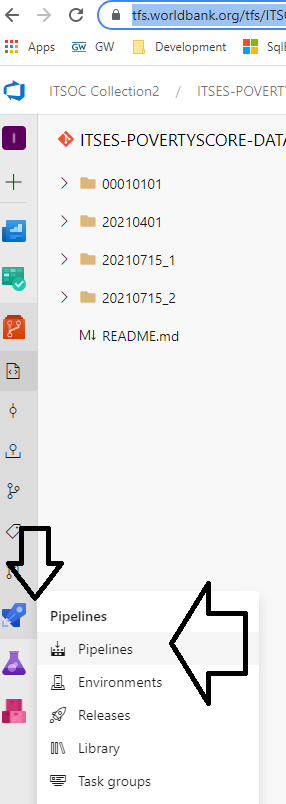
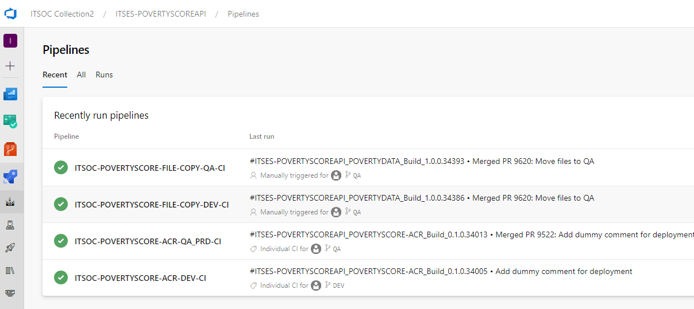
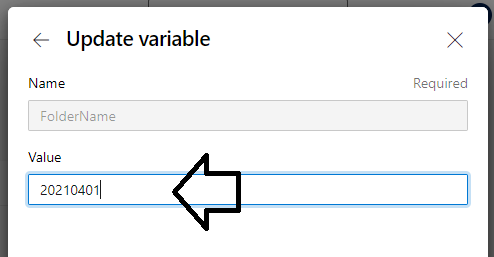
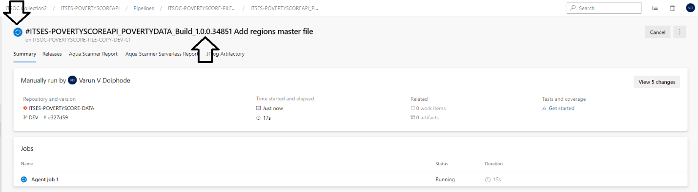
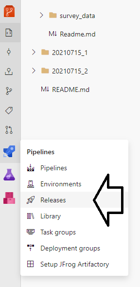
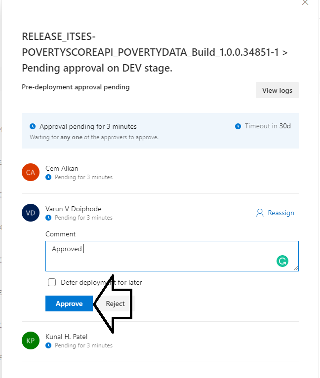
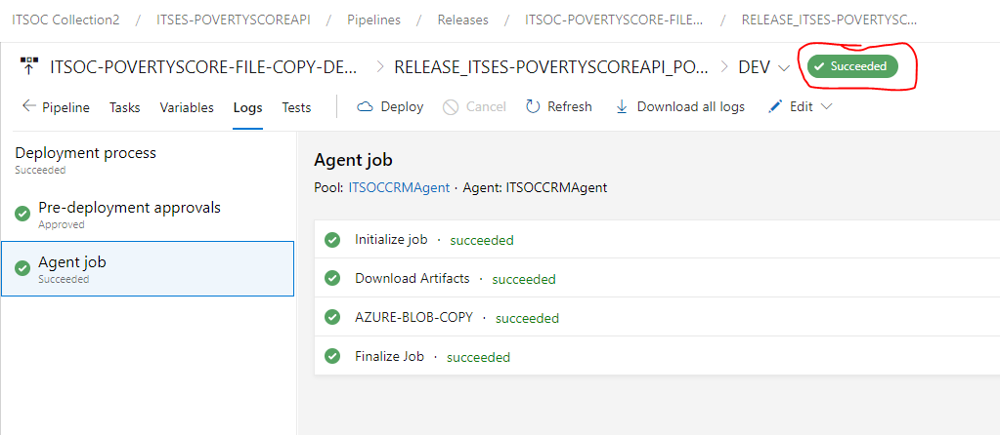

# Deploying to Azure {#azure}

The Azure DevOps site for PIP currently consists of two repos:

-   ITSES-POVERTYSCORE (docker file repo)

-   ITSES-POVERTYSCORE-DATA (data repo)

Each repo consists of three branches:

-   DEV

-   QA

-   PROD

The PIP Technical Team will handle deployments to DEV and QA, while ITS needs to approve deployments to Production.

## Poverty Calculator Data {#azure-pc-data}

[Note: These are **temporary instructions**. In the (near) future the Azure Data repo will be directly synced with pipeline outputs folder on the PIP network drive. There will then be no need to clone the repo to your local computer.]{style="color:red"}

Before you start with the data deployment process you will need to clone the Azure DevOps Data repo (DEV branch) to your local machine.
You will only need to do this once.
After that you can follow the step by step guide below.

### Deploying data on DEV

Deploying the data to DEV consists of four main stages:

-   Sync local data to remote Git repository on TFS

-   Run the Continuous Integration pipeline (CI)

-   Run the Continuous Deployment pipeline (CD) to move the data to Azure blob storage

-   Data is moved to the Virtual Machine (VM) running the API This stage is completed automatically every 30 minutes (as of 11/02/2021)

You can deploy data to DEV by following the steps below:

#### Sync data to remote repo on TFS

**Step 1:** Sync you local DEV branch with the remote.

**Step 2:** Commit and push any data changes to the remote.

#### Run CI pipeline

**Step 3:** Nagivate to the [Azure DevOps Data repo](https://github.com/PIP-Technical-Team/PIP_private/blob/main/README.md#resources).
    Click on Pipelines.

**Step 4:** Select the FILE-COPY-DEV-CI pipeline.

**Step 5:** Click on Run pipeline.

**Step 6:** Click on Variables -> FolderName, and add the name of the folder which should be copied to the Cloud Blob Store.

[Note: This step is likely to change when the Data pipeline is re-written to handle mulitiple data version folders.]{style="color:red"}

**Step 7:** Click on Run.

**Step 8:** View the new build.

####  Run CD pipeline

**Step 9:** Click on Releases and select the FILE-COPY-DEV-CD release. Approve the pending request.

**Step 10:** Verify that the build completed.

#### Move data to VM

**Step 11:** Wait for the data on the VM to be updated. There is an automatic cron job that runs behind the scenes to copy the data from the blob storage to the VM. This runs at regular intervals, every 10 (?) minutes.

### Deploying data on QA

**Step 1:** Nagivate to the [Azure DevOps Data repo](https://github.com/PIP-Technical-Team/PIP_private/blob/main/README.md#resources).

**Step 2:** Click on Create pull request.
Select from DEV to QA.

**Step 3:** Go through the steps to commit and approve the pull request.
Please make sure that the **"Delete source branch" box is NOT checked**, ie.
don't delete the DEV branch.
(This default should be modified going forward)

**Step 5:** Go to Pipelines -> Pipelines and select the FILE-COPY-QA-CI pipeline.
Verify that the pipeline is building.
If it wasn't triggered you will need to trigger it manually.

**Step 6:** Go to Pipelines -> Releases and select the FILE-COPY-QA-CD release.
Approve the request, and verify that the build completes.

### Deploying data to Production

**Step 1:** Nagivate to the [Azure DevOps Data repo](https://github.com/PIP-Technical-Team/PIP_private/blob/main/README.md#resources).

**Step 2:** Click on Create pull request.
Select from QA to PROD.

**Step 3:** Go through the steps to commit and approve the pull request.
Please make sure that the "Delete source branch" box is unchecked, ie.
don't delete the QA branch.

**Step 5:** Go to Pipelines -> Pipelines and select the FILE-COPY-PROD-CI pipeline.
Verify that the pipeline is building.
If it wasn't triggered you will need to trigger it manually.

**Step 6:** Go to Pipelines -> Releases and select the FILE-COPY-QA-CD release.
Wait for ITS to approve the request, and then verify that the build completes.

## Poverty Calculator Docker image {#azure-pc-docker}

Before you start with the application deployment process you will need to clone the [Azure DevOps Docker](https://github.com/PIP-Technical-Team/PIP_private/blob/main/README.md#resources) repo (DEV branch) to your local machine.
You will only need to do this once.
After that you can follow the step by step guide below.

Please note that it is important that data changes are pushed through and released before deploying the Docker image.
This is because the Docker container will need to restart in order to pick up changes in the mounted folder or volume.
The best way to do this is to deploy the data, and then use the API restart pipeline to ensure a restart of the Docker container.

### Deploying image on DEV

**Step 1:** Verify that the latest code in the master branches of {wbpip} and {pipapi} works with the latest data on DEV.
This can be done by running the {pipapi} package in a local RStudio session.

**Step 2:** \[Optional\] Verify that the most recent Dockerfile builds on your local machine.
This is certainly something that should be done if the contents of the Dockerfile has changed, or before major releases.
But in a continuous workflow where you know that Dockerfile hasn't changed, it might be sufficient to verify that the R packages in question are working.

**Step 3:** Navigate to the [Azure DevOps Docker repo](https://github.com/PIP-Technical-Team/PIP_private/blob/main/README.md#resources).
Go Pipelines -> Pipelines.
Trigger the CONTAINER-DEV-CI pipeline, either by\
a) Pushing an updated Dockerfile to the remote repo or\
b) Running the Pipeline manually.

**Step 4:** Go to the Pipelines -> Releases, and select "Create release" in order to run a new deployment.
View the logs to see results from the image build and security scan.

**Step 5:**.
Visit the [DEV API website](https://github.com/PIP-Technical-Team/PIP_private/blob/main/README.md#resources) for further testing.

### Deploying image on QA

**Step 1:** Check that the DEV deployment is working correctly.

**Step 2:** Make sure the data on QA is up-to-date (in sync with DEV).
If it isn't you will need to create a PR and merge the data first.

**Step 3:** Create a pull request from DEV to QA.
Go through the steps to commit and approve the pull request.
Please make sure that the **"Delete source branch" box is NOT checked**, ie.
don't delete the DEV branch.

**Step 4:** Go to the Release pipeline to see results from the image build and security scan.

**Step 5:** Visit the [QA API website](https://github.com/PIP-Technical-Team/PIP_private/blob/main/README.md#resources) for further testing.

### Deploying image to Production

**Step 1:** Check that the QA deployment is working correctly.

**Step 2:** Make sure the data on PROD is up-to-date (in sync with QA).
If it isn't you will need to create a PR and merge the data first.

**Step 3:** Create a pull request from QA to PROD.
Go through the steps to commit and approve the pull request.
Please make sure that the **"Delete source branch" box is NOT checked**, ie.
don't delete the QA branch.

**Step 4:** Go to the Release pipeline to see results from the image build and security scan.

**Step 5:** Visit the [PROD API website](https://github.com/PIP-Technical-Team/PIP_private/blob/main/README.md#resources) for further testing.
