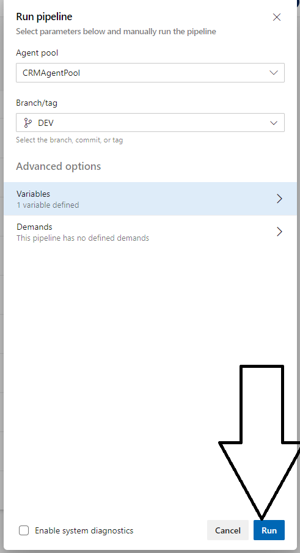

# Deploying to Azure {#azure}

The Azure DevOps site for PIP currently consists of two repos; ITSES-POVERTYSCORE and ITSES-POVERTYSCORE-DATA. Each repo consists of three branches; 
DEV, QA and PROD. The PIP Techincal Team will handle deployments to DEV and QA, while ITS need to approve deployments to Production. 
[Note: PROD deployments are TBD]{style="color:red"}

## Poverty Calculator Data {#azure-pc-data}

Before you start with the data deployment process you will need to clone the Azure DevOps Data repo (DEV branch) to your local machine. You will only need to this once. 
After that you can follow the step by step guide below. 
 
### Deploying data on DEV 

**Step 1:** Sync you local DEV branch with the remote. Commit and push any data changes to the remote. 

**Step 2:** Nagivate to the [Azure DevOps Data repo](https://github.com/PIP-Technical-Team/PIP_private/blob/main/README.md#resources). Click on Pipelines. 

**Step 3:** Select the FILE-COPY-DEV-CI pipeline. 

**Step 4:** Click on Run pipeline. 

**Step 5:** Click on Variables -> FolderName, and add the name of the folder which should be copied to the Cloud Blob Store.

**Step 6:** Click on Run. 

**Step 7:** View the new build. 

**Step 8:** Click on Releases and select the FILE-COPY-DEV-CD release. Approve the pending request.  

**Step 9:** Verify that the build completed. 

### Deploying data on QA

**Step 1:** Nagivate to the [Azure DevOps Data repo](https://github.com/PIP-Technical-Team/PIP_private/blob/main/README.md#resources).

**Step 2:** Click on Create pull request. Select from DEV to QA. 

**Step 3:** Go through the steps to commit and approve the pull request. 
Please make sure that the "Delete source branch" box is unchecked, 
ie. don't delete the DEV branch. 

**Step 5:** Go to Pipelines -> Piplines and select the FILE-COPY-QA-CI pipeline. 
Verify that the pipeline is building. If it wasn't triggered you will need to
trigger it manually. 

**Step 6:** Go to Pipelines -> Releases and select the FILE-COPY-QA-CD release. 
Approve the request, and verify that the build completes. 

### Deploying data to Production

TBD.

## Poverty Calculator Docker image {#azure-pc-docker}

Before you start with the application deployment process you will need to clone the Azure DevOps Docker repo (DEV branch) to your local machine. You will only need to this once. 
After that you can follow the step by step guide below. 

Please note that it is important that data changes are pushed through and released before deploying the Docker image. This is because the Docker container will need to restart in order 
to pick up changes in the mounted folder or volume. The best way to do this is to deploy the data, and then re-deploy the Docker image since a re-deployment includes a container restart. 

### Deploying image on DEV 

**Step 1:** Verify that the latest code in the master branches of {wbpip} and {pipapi} works with the latest data on DEV. This can be done by running the {pipapi} pacakge in a local RStudio session. 

**Step 2:** [Optional] Verify that the most recent Dockerfile builds on your local machine. This is certainly something that should be done if the contents of the Dockerfile has changed,
or before major releases. But in a continous workflow where you know that Dockerfile hasn't changed, it migth be sufficent to verify that the R packages in question are working. 

**Step 3:** Navigate to the [Azure DevOps Docker repo](https://github.com/PIP-Technical-Team/PIP_private/blob/main/README.md#resources). 
Go Pipelines -> Pipelines. Trigger the ACR-DEV-CI pipeline, either by a) Pushing an updated Dockerfile to the remote repo or b) Running the Pipeline manually. 

**Step 4:** Go to the Pipelines -> Releases and select "Create release" in order to run a new deployment. View the logs to see results from the image build and security scan. 

**Step 5:**. Vist the [DEV API website](https://github.com/PIP-Technical-Team/PIP_private/blob/main/README.md#resources) for further testing. 

 
### Deploying image on QA 

**Step 1:** Check that the DEV deployment is working correctly. 

**Step 2:** Make sure the data on QA is up-to-date (in sync with DEV). If it isn't you will need to create a PR and merge the data first. 

**Step 3:** Create a pull request from DEV to QA. Go through the steps to commit and approve the pull request.
Please make sure that the "Delete source branch" box is unchecked, ie. don't delete the DEV branch. 

**Step 4:** Go to the Release pipline to see results from the image build and security scan.

**Step 5:**  Vist the [QA API website](https://github.com/PIP-Technical-Team/PIP_private/blob/main/README.md#resources) for further testing.

### Deploying image to Production

TBD.

