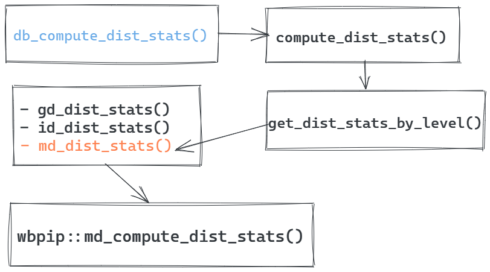

# Poverty Calculator Pipeline (pre-computed estimations) {#pcpipeline}

The Poverty Calculator Pipeline--hereafter, **pc pipeline**--is the technical
procedure to calculate the pre-computed estimations of the PIP project. These
estimations have two main purposes:

1.  Provide the user with instantaneous information about distributive measures
    of all the household surveys in the PIP repository that do not depend on the
    value of the poverty line, avoiding thus the need for re-computation as it
    was the case in PovcalNet for some of these measures.
2.  Provide the necessary inputs to the PIP API.

This chapter walks you through the folder structure of the folder, the main R
script, `_targets.R`, and the complete and partial execution of the script.
Also, it provides some tips for debugging.

## Folder structure

The pc pipeline is hosted in the Github repository
[PIP-Technical-Team/pip_ingestion_pipeline](https://github.com/PIP-Technical-Team/pip_ingestion_pipeline).
At the root of the repo you will find a series of files and folders.

```{r, eval=FALSE}
#> +-- batch
#> +-- pip_ingestion_pipeline.Rproj
#> +-- R
#> +-- README.md
#> +-- renv
#> +-- renv.lock
#> +-- run.R
#> +-- _packages.R
#> \-- _targets
#> \-- _targets.R
```

### Folders {.unnumbered}

-   `R` Contains long R functions used during the pipeline

-   `batch` contains a script for timing the execution of the pipeline. This
    folder should probably be removed

-   `_targets` contains a folder for all objects created during the pipeline.
    You don't need to look inside as its content is managed by the `{targets}`
    package.

-   `renv` contains reproducible environment.

### Files {.unnumbered}

-   `_packages.R` Created by `targets::tar_renv()`. Do not modify it manually.

-   `_targets.R` Contains the pipeline. This is the most important file.

## Prerequisites

Before you start working on the pc pipeline, you need to make sure to have the
following PIP packages.

[Note:]{style="color:red"} Notice that directives below have suffixes like
`@development`, which specify the branch of the particular package that you need
to use. Ideally, the master branch of all packages should be used, but that will
only happen until the end of the development process.

```{r, eval=FALSE}
remotes::install_github("PIP-Technical-Team/pipload")
remotes::install_github("PIP-Technical-Team/wbpip@get_synth_vector")
remotes::install_github("PIP-Technical-Team/pipdm")
install.packages("joyn")
```

In case `renv` is not working for you, you may need to install all the packages
listed in the `_packages.R` script, located at the root of the folder. Also,
make sure to install the most recent version of the `{targets}` and
`{tarchetypes}` packages.

## Structure of the `_targets.R` file

Even thought the pc pipeline script looks like a regular R Script, it is
structured in a specific way in order to make it work with the `{targets}`
package, starting by the fact that it must be called `_targets.R` in the root of
the project. It is highly recommended that you read the entire [targets
manual](https://books.ropensci.org/targets/) to fully understand how it works.
Also, during this chapter, we will referring to the manual constantly to expand
in any particular concept.

### Start up {.unnumbered}

The first part of the pipeline sets up the environment. It,

1.  loads the `{targets}` and `{tarchetypes}` packages,
2.  creates default values like directories, time stamps, survey and reference
    years boundaries, compression level of .fst files, among other things.
3.  executes `tar_option_set()` to set up some options in `{targets}`. Two
    particular options are important, `packages` and `imports` for tracking
    changes in package dependencies. You can read more about it in sections
    [Loading and configuring R
    packages](https://books.ropensci.org/targets/practices.html#loading-and-configuring-r-packages)
    and [Packages-based
    invalidation](https://books.ropensci.org/targets/practices.html#packages-based-invalidation)
    of the targets manual.
4.  Attach all the packages and functions of the project by running
    `source('_packages.R')` and `source('R/_common.R')`

### Step 1: small functions {.unnumbered}

According to the section [Functions in
pipelines](https://books.ropensci.org/targets/functions.html#functions-in-pipelines)
of the targets manual, it is recommend to only use functions rather than
expressions during the executions. Presumably, the reason is that `{targets}`
track changes in functions but not in expressions. Thus, this section of the
scripts defines small functions that are executed along the pc pipeline. In the
section above, the line `source('R/_common.R')` loads longer functions. Yet,
keep in mind that the `'R/_common.R'` was used in a previous version of the pc
pipeline before `{targets}` was implemented. Now, most of the function in
`'R/_common.R'` are included in the `{pipdm}` package.

### Step 2: prepare data {#pipe-prepare-data .unnumbered}

This section used to be longer in previous versions of the pc pipeline because
it identified the auxiliary data, loaded he PIP microdata inventory, and created
the cache files. Now, it only identifies the auxiliary data and creates the data
frame `aux_tb`, which is used inside the pc pipeline to create targets for each
auxiliary file. Not much more to say here.

### Step 3: The actual pipeline

This part of the pc pipeline is long and it is explained in detail in the next
section. Suffice is to say that the order of the pc pipeline is the following,

1.  Load all necessary data. That is, auxiliary data and inventories, and then
    create any cache fie that has not been created yet.

2.  Calculate means in LCU

3.  Create deflated survey mean (DSM) table

4.  Calculate reference year table (aka., interpolated means table)

5.  Calculate distributional stats

6.  Create output tables

    1.  join survey mean table with dist table

    2.  join reference year table with dist table

    3.  coverage table aggregate population at the regional level table

7.  Clean and save.

## Understanding the pipeline

One thing is to understand how the `{targets}` package works and something else
is to understand how the targets of the Poverty Calculator pc pipeline are
created. For the former, you can read the targets manual. For the latter, we
should start by making a distinction between the different types of targets.

In `{targets}` terminology, there are two kinds of targets, **stems** and
**branches**. **Stems** are unitary targets. That is, for each target there is
only one single R object. **Branches**, on the other hand, are targets that
contain several objects or *subtargets* inside (You can learn more about them in
the chapter [Dynamic
branching](https://books.ropensci.org/targets/dynamic.html#dynamic) of the
targets manual). We will see the use of this type of targets when we talk about
the use of cache files.

### Stem targets {.unnumbered}

There are two ways to create **stem** targets: either using `tar_target()` or
using `tar_map()` from the `{tarchetypes}` package. The `tar_map()` function
allows to create **stem** targets iteratively. See for instance the creation of
targets for each auxiliary data,

```{r, eval=FALSE}
tar_map(
  values = aux_tb, 
  names  = "auxname", 
  
  # create dynamic name
  tar_target(
    aux_dir,
    auxfiles, 
    format = "file"
  ), 
  tar_target(
    aux,
    pipload::pip_load_aux(file_to_load = aux_dir,
                          apply_label = FALSE)
  )
  
)
```

`tar_map()` takes the values in the data frame `aux_tb` created in [Step 2:
prepare data](#pipe-prepare-data) and creates two type of targets. First, it
creates the target `aux_dir` that contains the paths of the auxiliary files,
which are available in the column `auxfiles` of `aux_tb`. This is done by
creating an internal target within `tar_map()` and using the argument
`format = "file"`. This process lets `{targets}` know that we will have objects
that are loaded from a file and are not created inside the pc pipeline.

Then, `tar_map()` uses the the column `auxname` of `aux_tb` to name the targets
that contain the auxiliary files. Each target will be prefixed by the word
"aux". This is why we had to add the argument `file_to_load` to
`pipload::pip_load_aux`, so we can let `{targets}` know that the file paths
defined in target `aux_dir` are used to create the targets prefixed with "aux",
which are the actual targets. For example, if I need to use the population data
frame inside the pc pipeline, I'd use the target `aux_pop`, which had a
corresponding file path in `aux_dir`. In this way, if the original file
referenced in `aux_dir` changes, all the targets that depend on `aux_pop` will
be run again.

### Branches targets {.unnumbered}

Let's think of a branch target like

As explained above, branch targets are targets made of many "subtargets" that
follow a particular pattern. the Most of the targets created in the pc pipeline
are **branch** targets because we need to execute the same procedure in every
cache file. This could have been done internally in one single, but then we
would lose the tracking features of `{targets}`. Also, we could have created a
**stem** target for every cache file, result, and output file, but that would
have been not only impossible to visualize, but also more difficult to code.
Thus branch targets is the best option.

The following example illustrates how it works,

```{r, eval=FALSE}

# step A
tar_target(
  cache_inventory_dir, 
  cache_inventory_path(),
  format = "file"
),

# step B
tar_target(
  cache_inventory, 
  {
    x <- fst::read_fst(cache_inventory_dir, 
                       as.data.table = TRUE)
  },
),

# step C
tar_target(cache_files,
           get_cache_files(cache_inventory)),

# step D
tar_files(cache_dir, cache_files),

# step E
tar_target(cache, 
           fst::read_fst(path = cache_dir, 
                         as.data.table = TRUE), 
           pattern = map(cache_dir), 
           iteration = "list")
```

The code above illustrates several things. It is divided in steps, being the
last step-- step E--the part of the code in which we create the **branch**
target. Yet, it is important to understand the steps before.

In step A we create target `cache_inventory_dir`, which is merely the path of
the file than contains the cache inventory. Notice that it is returned by a
function and not entered directly into the target. Since it is a file path, we
need to add the argument `format = "file"` to let `{targets}` know that it is
input data. In step B we load the cache inventory file into target
`cache_inventory` by providing the target "path" that we created in step A. This
file has several column. One of them contains the file path of every single
cache file in the PIP network drive. That single column is extracted from the
cache inventory in step C. Now, in step D, each file path is declared as input,
using the convenient function `tar_files()`, creating thus a new target,
`cache_dir`. FInally, we create **branch** target `cache` with all the cache
files by loading each file. To do this iteratively, we parse the `cache_dir`
target to the `path` argument of the function `fst::read_fst()` and to the
`pattern = map()` argument of the `tar_target()` function. Finally, we need to
specify that the output of the iteration is stored as a list, using the argument
`iteration = "list"`.

The basic logic of **branch** targets is that the vector or list to iterate
through should be parsed to the argument of the function and to the
`pattern = map()` argument of the `tar_target()` function. it is very similar to
`purrr::map()`

[Note:]{style="color:red"} If we are iterating through *more than one* vector or
list, you need to (1) separate each of them by commas in the `map()` part of the
argument (See example code below). (2) make sure all the vectors or lists **have
the same length**. This is why we cannot remove NULL or NA values from any
target. (3) make sure you do **NOT** sort any of the output targets as it will
loose its correspondence with other targets.

```{r, eval=FALSE}

# Example of creating branch target using several lists to iterate through.
tar_target(
  name      = dl_dist_stats,
  command   = db_compute_dist_stats(dt       = cache, 
                                    mean     = dl_mean, 
                                    pop      = aux_pop, 
                                    cache_id = cache_ids), 
  pattern   =  map(cache, dl_mean, cache_ids), 
  iteration = "list"
)
```

### Creating the cache files {.unnumbered}

The creation of the cache files is done in the following code,

```{r, eval=FALSE}
tar_target(pipeline_inventory, {
  x <- pipdm::db_filter_inventory(
    dt = pip_inventory,
    pfw_table = aux_pfw)
  
  # Uncomment for specific countries
  # x <- x[country_code == 'IDN' & surveyid_year == 2015]
}
),
tar_target(status_cache_files_creation, 
           pipdm::create_cache_file(
             pipeline_inventory = pipeline_inventory,
             pip_data_dir       = PIP_DATA_DIR,
             tool               = "PC",
             cache_svy_dir      = CACHE_SVY_DIR,
             compress           = FST_COMP_LVL,
             force              = TRUE,
             verbose            = FALSE,
             cpi_dt             = aux_cpi,
             ppp_dt             = aux_ppp)
)
```

It is important to understand this part of the pc pipeline thoroughly because
the cache files used to be created in [Step 2: prepare data](#pipe-prepare-data)
rather than here. Now, it has not only been integrated in the pc pipeline, but
it is also possible to execute the creation of cache files independently from
the rest of the pipeline, by following the instructions in [Executing the
\_targets.R file].

The first target, `pipeline_inventory` is just the inner join of the pip
inventory dataset and the price framework (pfw ) file to make sure we only
include what the **pfw** says. This data set also contains a lot of information
useful for creating the cache files. Notice that the commented line in this
target would filter the pipeline inventory to have only the information for IDN,
2015. [In case you need to update specific cache files, you have to do add the
proper filtering condition in there]{style="color:red"}.

In the second target, `status_cache_files_creation`, you will create the cache
files but notice that the returning value of the function
`pipdm::create_cache_file()` is not the cache file per-se but a list with the
status of the process of creation. If the creation of a particular file fails,
it does not stop the iteration that creates the all cache files. At the end of
the process, it returns a list with the creation status of each cache file.
Notice that function `pipdm::create_cache_file()` requires the CPI and the PPP
auxiliary data. This is so because the variable `welfare_ppp`, which is the
welfare aggregate in 2011 PPP values, is added to the cache files. FInally, and
more importantly, argument `force = TRUE` ensures that even if the cache file
exists already, it should be modified. This is important when you require
additional features in the cache file from the then ones it has now. If set to
`TRUE`, it will replace any file in the network drive that is listed in
`pipeline_inventory`. If set to `FALSE`, only the files that are in
`pipeline_inventory` but not in the cache folder will be created. Use this
option only when you need to add new features to all cache data or when you are
testing and only need a few surveys with the new features.

## Understanding `{pipdm}` functions

The `{pipdm}` package is the backbone of the pc pipeline. It is in charge of
executing the functions in `{wbpip}` and consolidate the new DataBases. This is
why, many of the functions in `{pipdm}` are prefixed with "db\_".

### Internal structure of `{pipdm}` functions

The main objective of `{pipdm}` is to execute the functions in `{wbpip}` to do
the calculations and then build the data frames. As of today, `r Sys.Date()`,
the process is a little intricate.

Let's take the example of estimating distributive measures in the pipeline. The
image [below](#pipdm-structure) shows that there are at least three intermediate
function levels between the `db_compute_dist_stats()` function, which executed
directly in the pc pipeline, and the `wbpip::md_compute_dist_stats()`, which
makes the calculations. Also, notice that the functions are very general in
regards to the output. No higher level function is specific enough to retrieve
only one measure such as the Gini coefficient, or the median, or the quantiles
of the distribution. If you need to add or modify one particular distributive
measure, you must do it in functions inside `wbpip::md_compute_dist_stats()`,
making sure the new output does not mess up the execution of any of the
intermediate functions before the results get to `db_compute_dist_stats()`.

{#pipdm-structure}

This long chain of functions is inflexible and makes debugging very difficult.
So, if you need to make any modification, identify first the chain of execution
in each `pipdm` function you modify and then make sure your changes do not
affect the output format as it may break the chain of execution. Also, this is a
good example to show why this structure needs to be improved.

### Updating `{pipdm}` (or any other PIP package)

As explained above, if you need to modify any function in `pipdm` or in `wbpip`
you need to make sure that the output does not conflict with the chain of
execution. Additionally, If you update any of the packages developed by the PIP
team, make sure you always increased the version of the package using the
function `usethis::use_version()`. Even if the change in the package is small,
you need to increase the version of the package. Otherwise, `{targets}` won't
execute the sections of the pipeline that run the functions you changed. Finally
as explained in the [Prerequisites], if you are working on a branch different
than master, make sure you install that version of the package before running
the pipeline.

## Executing the `_targets.R` file

The `.Rprofile` in the root of the directory makes sure that both `{targets}`
and `{tarchetypes}` are loaded when the project is started. The execution of the
whole pipeline might be very time consuming because it still needs to load all
the data in the network drive. If you use a desktop remote connection the
execution might be faster than running locally, but it is still very time
consuming. So, my advise is that you only execute the targets that are directly
affected by your changes and manually check that everything looks ok. After
that, you can execute the whole thing confidently and leave it running
overnight.

In order to execute the whole pipeline, you only need to type the directive
`tar_make()` in the console. If you want to execute only one target, then type
the name of the target in the same directive, e.g., `tar_make(dl_dist_stats)`.
Keep in mind that if the inputs of prior targets to the objective target have
changed, those targets will be executed first.

## Debugging

Debugging in targets is not easy. Yet, there are two ways to do it. The first
way is provided in the chapter
[Debugging](https://books.ropensci.org/targets/debugging.html) of the Targets
Manual. It provides clear instruction on how to debug *while still being in the
pipeline*, but it could be the case, as it happened to me, that you don't find
this method flexible enough to dig deep enough into the problem. Alternatively,
you could debug by stepping out of the pipeline a little bit and gain more
flexibility. This is how I do it.

You need to debug in one of two case. One, because you got an error when running
the pipeline with `tar_make()` or, two, because your results are weird. In
either case, you should probably have an idea--though not always--of where the
problem is. If the problem is an error in the execution of the pipeline,
`{targets}` printed messages are usually informative.

### Debugging stem targets {.unnumbered}

Let's see a simple example. Assume the problem is in the target `dt_dist_stats`,
which is created by executing the function `db_create_dist_table` of the
`{pipdm}` package. Since the problem is in there, all the targets and inputs
necessary to create `dt_dist_stats` should be available in the `_targets/` data
store. So, you can load them using `tar_load()` and execute the function in
debugging mode. Like this,

```{r, eval=FALSE}

tar_load(dl_dist_stats)
tar_load(svy_mean_ppp_table)
tar_load(cache_inventory)

debugonce(pipdm::db_create_dist_table)
pipdm::db_create_dist_table(
  dl        = dl_dist_stats,
  dsm_table = svy_mean_ppp_table, 
  crr_inv   = cache_inventory
  )
```

Notice that you need to use the `::` because the environment in which
`{targets}` runs is different from your Global environment in which you might
not have attached all the libraries.

### Debugging branch targets {.unnumbered}

The problem debugging branch targets is that if the problem is in a specific
survey, you can't access the "subtarget" using the survey ID, or something like
that, because the name of the subtarget is created by `{targets}` using a random
number. This requires a little more of work.

Imagine now that the distributive measures of IDN 2015 are wrong. You see the
pipeline and notice that these calculation are executed in target
`dl_dist_stats`, which is branch target created over **all the cache files!** It
looks something like this,

```{r, eval=FALSE}
tar_target(
  name      = dl_dist_stats,
  command   = db_compute_dist_stats(dt       = cache, 
                                    mean     = dl_mean, 
                                    pop      = aux_pop, 
                                    cache_id = cache_ids), 
  pattern   =  map(cache, dl_mean, cache_ids), 
  iteration = "list"
)
```

In order to find the problem in IDN 2015, this what you could do,

```{r, eval=FALSE}
# Load data
dt <- pipload::pip_load_cache("IDN", 2015, "PC")
tar_load(dl_mean)
tar_load(cache_ids)
tar_load(aux_pop)

# Extract corresponding mean and cache ID
idt      <- which(cache_ids == unique(dt$cache_id))
cache_id <- cache_ids[idt]
mean_i   <- dl_mean[[idt]]

# Esecute the function of interest
debugonce(pipdm:::compute_dist_stats)
ds <- pipdm::db_compute_dist_stats(dt       = dt, 
                                   mean     = mean_i, 
                                   pop      = aux_pop, 
                                   cache_id = cache_id)
```

First, you load all the inputs. Since target `dl_mean` is a relatively light
object, we load it directly from the `_targets/` data store. Targets `cache_ids`
and `aux_pop` are data frames, not lists, so we also load them from memory. The
microdata, however, is problematic because target `cache`, which is the one that
is parsed to create the **actual** `dl_dist_stata` target, is a huge list with
all the micro, grouped, and imputed data. The solution is then to load the data
frame of interest, using either `pipload` or `fst`.

Secondly, we need to filter the list `dl_mean` and the data frame `cache_ids` to
parse only the information accepted by `pipdm::db_compute_dist_stats()`
function. This has to be done when debugging because in the actual target this
is done iteratively in `pattern   =  map(cache, dl_mean, cache_ids)`.

Finally, you execute the function of interest. Notice something else. The target
`aux_pop` is parsed as a single data frame because
`pipdm::db_compute_dist_stats()` requires it that way.
[Note:]{style="color:red"} This is also one of the reasons these functions in
`{pipdm}` need some fixing and consistency in the format of the their inputs.
